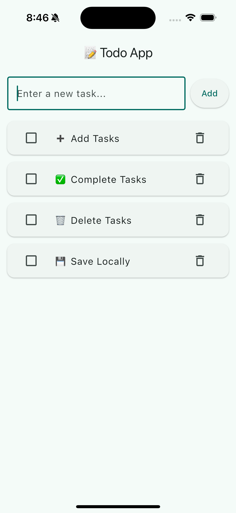

# 📚 Project 2: Todo App (Local State)

## 🎯 Goal

Learn how to **manage a simple list of tasks** using **local state** in Flutter.  
This project helps you understand how to handle UI updates dynamically with `setState()` and display data efficiently using `ListView.builder()`.

---

## 📝 Description

The **Todo App** lets users:

- ➕ Add new tasks
- ✅ Mark tasks as completed
- 🗑️ Delete tasks

All tasks are stored **locally on the device** (using `SharedPreferences`), so they remain even after restarting the app.

---

## ⚙️ Technical Requirements

- **Widgets & Concepts:**
  - `StatefulWidget`
  - `ListView.builder()`
  - `TextField`, `IconButton`, `CheckboxListTile`
- **State Management:**
  - `setState()` for updating the task list
- **Local Storage:**
  - `SharedPreferences` to persist data offline
- **UI Design:**
  - Clean, minimal layout with clear task status indicators

---

## 🌗 UI Preview



---

## 💻 How to Run

1. **Clone this repository**

   ```bash
   git clone https://github.com/lamthu256/todo_app.git
   cd todo_app
   ```

2. **Edit `pubspec.yaml`**

   ```bash
   dependencies:
     flutter:
        sdk: flutter
     shared_preferences: ^2.2.3
   ```

3. **Run the app**
   ```bash
   flutter pub get
   flutter run
   ```

## 📱 App Structure

```
lib/
 ├── main.dart          # Main app file
```

## 🧩 Key Features

| Feature           | Description                             |
| ----------------- | --------------------------------------- |
| ➕ Add Tasks      | Add a new to-do item using a text field |
| ✅ Complete Tasks | Tap checkbox to mark as done            |
| 🗑️ Delete Tasks   | Swipe or tap delete button to remove    |
| 💾 Save Locally   | Use SharedPreferences for persistence   |

## 🧑‍💻 Author

**Trần Thị Lâm Thư**
